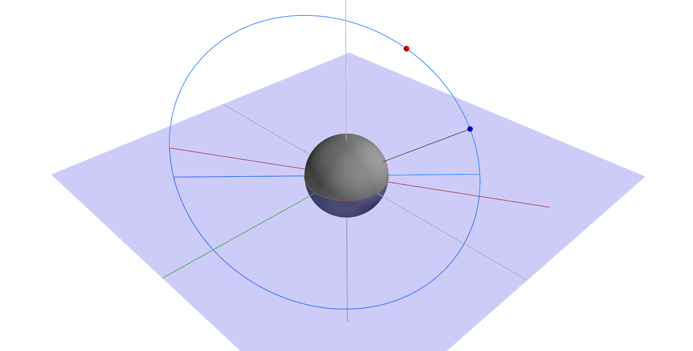

# orbital-dynamic-demonstrator
A Python project for calculating and demonstrating dynamics of an orbital motion.

# Example two-body orbital dynamic
Using Mayavi package for visualization.

Displaying a starting position of a body (blue dot) and it's current position (red dot) on an orbit.

